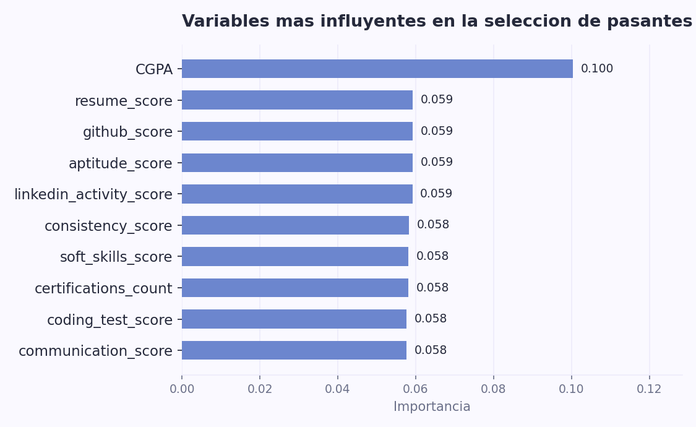

# 🎓 Predicción de Selección de Pasantes con Machine Learning

## 🎯 Descripción del Problema

TechNova Solutions recibe un alto volumen de postulantes en cada periodo de reclutamiento de pasantías. Evaluar manualmente el rendimiento académico, las habilidades técnicas, el desempeño en entrevistas y la experiencia extracurricular de cada candidato vuelve el proceso lento, subjetivo e inconsistente, lo que puede llevar a decisiones de contratación poco fundamentadas y pérdida de talento frente a procesos de selección más ágiles.

## 🔧 Solución Propuesta

Se desarrolló un modelo de clasificación de aprendizaje automático que predice si un candidato será seleccionado para una pasantía a partir de sus características académicas, técnicas y personales (CGPA, puntajes de habilidades técnicas y blandas, proyectos, certificaciones, resultados de entrevista, entre otras). Además se construyó una app interactiva en **Streamlit** donde se puede ingresar el perfil de un candidato y obtener la predicción en tiempo real. El objetivo es automatizar y estandarizar el proceso de preselección, reduciendo el tiempo y el sesgo humano en la evaluación inicial de postulantes.

## 📊 Resultados Principales

- **Accuracy:** [completar]
- **Precision:** [completar]
- **Recall:** [completar]
- **F1-score:** [completar]
- **Variables más importantes:** [completar] (según el análisis de importancia de características)



## 🚀 Cómo Ejecutar el Proyecto

### 1. Clonar el repositorio

```bash
git clone https://github.com/ARTARAUZ/prediccion-seleccion-pasantes.git
cd prediccion-seleccion-pasantes
```

### 2. Instalar dependencias

```bash
pip install -r requirements.txt
```

### 3. Ejecutar el análisis (notebook)

```bash
jupyter notebook src/notebooks/analisis_seleccion_pasantes.ipynb
```

### 4. Ejecutar la app interactiva (Streamlit)

```bash
streamlit run src/app/app.py
```

## 📁 Estructura del Proyecto

```
├── data/
│   └── internship_selection_dataset.csv    # Dataset original (Kaggle)
├── models/                                 # Modelos entrenados guardados (.pkl)
├── src/
│   ├── notebooks/
│   │   └── analisis_seleccion_pasantes.ipynb   # EDA + preprocesamiento + modelado
│   └── app/
│       └── app.py                          # App interactiva en Streamlit
├── images/
│   └── feature_importance.png              # Gráficos exportados del notebook
├── requirements.txt                        # Librerías necesarias
├── setup.py                                # Hace que src/ sea instalable como paquete
├── config.yaml                             # Parámetros del proyecto (rutas, semillas, etc.)
├── .gitignore
└── README.md
```

## 🛠️ Tecnologías Utilizadas

- Python 3.x
- pandas, numpy
- scikit-learn
- matplotlib, seaborn
- Jupyter Notebook
- Streamlit

## 📈 Metodología

1. **Recolección de datos**: dataset público "Internship Selection Prediction Dataset" (Kaggle), 10,000 registros y 21 columnas (20 predictoras + variable objetivo `selected`).
2. **Análisis exploratorio (EDA)**: revisión de tipos de variables, valores nulos, distribución de la variable objetivo (desbalance ~74%/26%), histogramas, boxplots y matriz de correlación.
3. **Preprocesamiento**: imputación de nulos, codificación de variables categóricas (`extracurricular`, `college_tier`, `placement_training`), escalado de variables numéricas y construcción de un pipeline de transformación con `scikit-learn` (`ColumnTransformer`, `Pipeline`).
4. **División de datos**: separación estratificada en conjuntos de entrenamiento y prueba para preservar la proporción de la clase objetivo.
5. **Modelado**: entrenamiento y comparación de modelos de clasificación, evaluados con métricas apropiadas para clases desbalanceadas (precision, recall, F1-score) además de accuracy.
6. **Interpretación**: análisis de importancia de características para identificar los factores con mayor influencia en la decisión de selección.

## 💡 Conclusiones y Aprendizajes

> Completar al finalizar el análisis: qué modelo funcionó mejor y por qué, qué variables resultaron más determinantes, qué valor le aportaría este modelo al proceso de selección de TechNova Solutions, y qué mejoras futuras se podrían aplicar (por ejemplo, incorporar más datos, probar otros algoritmos, ajustar hiperparámetros).

## 👥 Autores

- Aaron M. Ramirez Mota
- Ariana P. Fallas Calderón
- Jeremy F. Picado Chavarria
- Oscar A. Arauz Cerdas

Proyecto final — curso SC-707 Big Data, Universidad Fidélitas.

## 📚 Fuentes

- Dataset: [Internship Selection Prediction Dataset — Kaggle](https://www.kaggle.com/)
